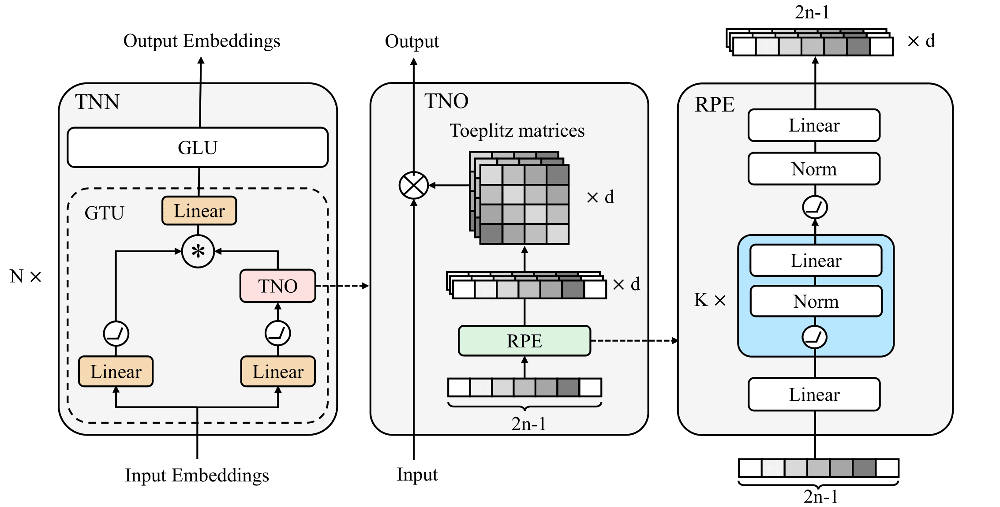

# Tnn-Pytorch
This repository contains the Rpe, Tno, Gtu and Tnn layers mentioned in [Toeplitz Neural Network for Sequence Modeling](https://openreview.net/forum?id=IxmWsm4xrua). The overall network structure is as follows:




## Install

```
$ pip install tnn-pytorch
```

## Introduction
wip.

## Usage

Pelease refer to `example.py` to understand the use of modules.

### Tno


## Recommended configuration

### TnnLayer

We recommend initializing `TnnLayer`with the following configuration, the number of model parameters is approximately equivalent to a standard transformer layer:

```
dim=your_embedding_dim, 
num_heads=1,
rpe_embedding=max(your_embedding_dim // 8, 32),
glu_dim=your_embedding_dim,
# model params
prenorm=True,
norm_type="simplermsnorm",
# gtu params
causal=False, # True for language model
gtu_act="silu",
expand_ratio=3,
use_decay=True,
gamma=0.9 for seqlen < 100, else 0.99
# rpe params
rpe_act="relu",
rpe_layers=1,
# glu params
glu_act="silu",
```


### Gtu

If you only want to use `Gtu`, we recommend the following configuration:

```
embed_dim=your_embedding_dim,
num_heads=1,
act_fun="silu",
norm_type="simplermsnorm",
causal=False, # True for language model
expand_ratio=3,
use_decay=True,
gamma=0.9 for seqlen < 100, else 0.99
rpe_embedding=max(your_embedding_dim // 8, 32),
rpe_act="relu",
rpe_layers=1,
```


## Todo

- [x] Tnn layer
- [ ] Tnn model
- [x] Recommended configuration
- [ ] Introduction

